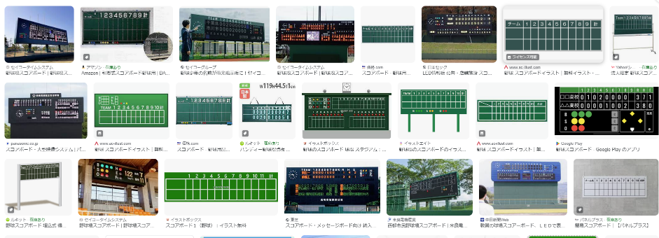

# Lesson1: まず表示してみよう

## 概要

さっきクローンしたプロジェクトのなかに、`src/pages/`というディレクトリがあります。これは Next.js の中心になります。  
さらにその下に `lessons` ディレクトリがあると思いますが、この下に皆さんの成果物を作成してもらいます。

まずは、ページのレイアウトや表示に慣れてもらいましょう。

## それではお題です

野球のスコアボードを、Web ページ上に再現してもらいます。

[このリンク](https://www.google.com/search?newwindow=1&q=%E9%87%8E%E7%90%83%E3%81%AE%E3%82%B9%E3%82%B3%E3%82%A2%E3%83%9C%E3%83%BC%E3%83%89&tbm=isch&source=lnms&prmd=isvnmbtz&sa=X&bih=919&dpr=1) に掲載されている実物を参考に、Web 上に再現してください。

## 仕様

- 最低限表示する内容は以下の通りです
  - チーム名（先攻・後攻）
  - イニング（１～９）
  - 各回の得点（先攻・後攻）
  - 合計点（先攻・後攻）
- 余裕があるひとは、以下の仕様も加えるとかっこいいよ

  - ヒット数・エラー数（先攻・後攻）
  - 延長戦になっても対応できる
  - 「野球のスコアボード」という概念のなかで、「あればいいな」という思う仕様は、自由に追加しても構いません。（ただし、作るからにはキチンと動作させること）

- アプリの振る舞いは以下のようにしてください。
  - 最初にページを開いたときは、すべてが空白で表示されること。
  - ボタンを押すと、チーム名が表示されること。  
    チーム名は、NPB でも MLB でも高校野球でも近所の草野球でもなんでも構いません。
  - もう一度ボタンを押すと、試合結果が埋まること。  
    得点等は、適当な値で構いませんが、１回に 100 点とかいう非現実的なものは NG です。

## 進め方

1. lesson1 用のブランチを作成してください。  
   最初に作った自分用のブランチから、_your_id_/lesson1 ブランチを作成してください。
1. 必要であれば他のファイルを作成して構いません。
1. [`src/pages/lessons/lesson1.tsx`](../src/pages/lessons/lesson1.tsx) を自分なりに書き換えて、スコアボードを完成させてください。
1. 既存のファイルを修正しても結構です。ただしその場合は、トップページの表示が壊れないように気を付けてください。
1. Typescript や React や Next.js については、ここでは書ききれないので、_自分で調べる_ とか _先輩に聞く_ とかして解決してください。
1. テストコードも書きましょう
1. Github への commit/push はマメに行ってください。
1. 完成したら、みんなで相互レビューを行いましょう。
