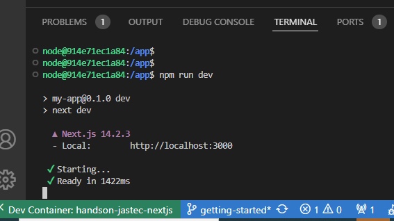

## 環境を整える

1. 自分の PC に WSL を導入してください。Windows11 の人はすでに入っているかもしれません。Windows10 の人は、自力で調べて解決してください。
1. WSL 環境に、演習用のリポジトリをクローンしてください。  
   `https://github.com/snc-nuro/poc-handson-jastec-nextjs.git`
1. クローンしたら、そのディレクトリを VsCode で開きましょう。
1. devContainer を Rebuild してください。
1. `getting-started`ブランチから、自分用のブランチを作成してください。
   自分用のブランチ名は _your-id_/main としてください。_your-id_ はあなたを識別する文字列です。好きなもので構いませんが、以下に注意
   - 他者と被らないように
   - 極端に長い文字列はいろいろ面倒になります
   - 極端に短いものこまります
   - 公序良俗に反しないこと
1. VsCode の Terminal で、`npm run dev` と叩いてみてください。特にエラーがなければ大丈夫です。
   
1. この URL [`http://localhost:3000`](http://localhost:3000) にブラウザからアクセスしてください。  
   画面上に前向きな単語で表示されていれば、成功です。

それでは、[最初の課題](./lesson1.md)に取り組みましょう！
